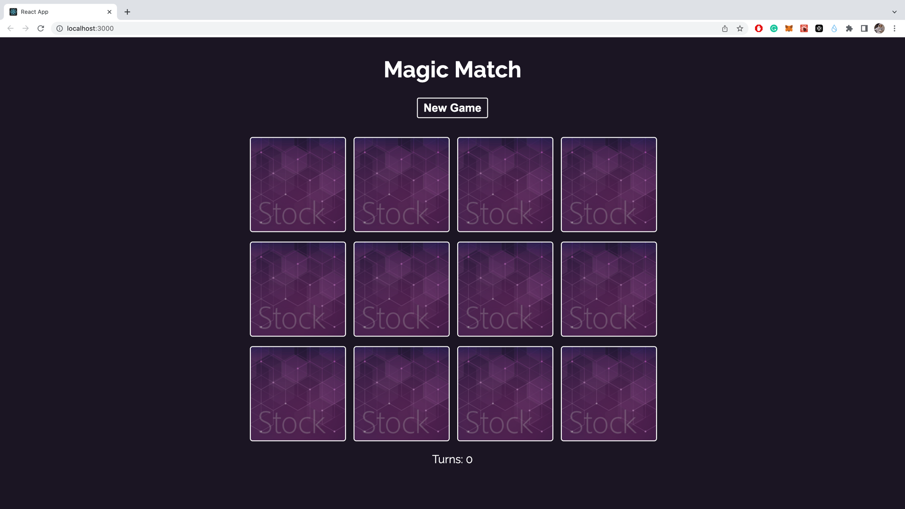
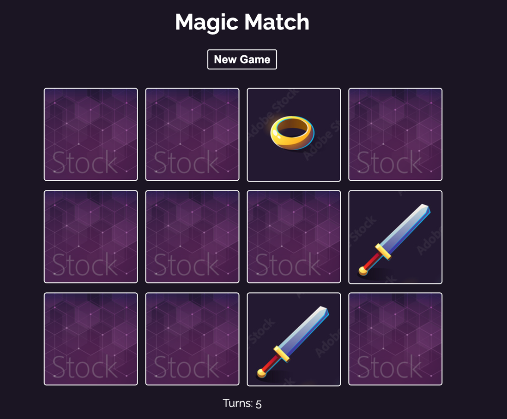

# Magic Memory

This project was bootstrapped with [Create React App](https://github.com/facebook/create-react-app).

## SetUp Steps

In the project directory, you can run:

```
npm install
npm install react-router-dom
npm install -g json-server
```
```
json-server --watch ./data/db.json
//Please open another terminal and type the below commmand
npm start
//Would you like to run the app on another port instead?
Y or yes
```


Runs the app in the development mode.\
Open [http://localhost:3001](http://localhost:3001) to view it in your browser.

The page will reload when you make changes.\
You may also see any lint errors in the console.

### `json-server`
Fetching the data from local `./data/db.json` and send http requests

## Feature
1. Create a new game by clicking New Game
2. When two Cards are of the same type, the flipped state will be retained
   
3. When two cards are not of the same type, it will be reversed.
4. flip animation
5. Turns records the total number of steps
6. When two cards are in the process of reversing, the other cards will be disabled, so there is no way to click on the third card until the validate is finished.
